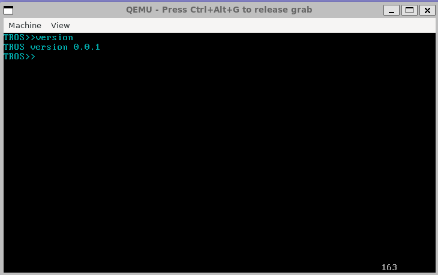
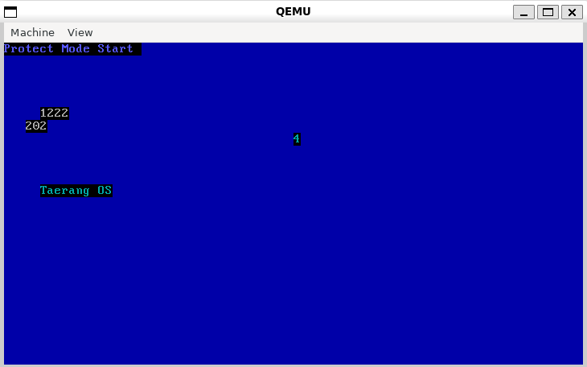

# TROS

I am creating my own operating system (TROS)

1. Make BootLoader
2. Change to protect mode
3. Make kernel
4. Compile with C

Complete a basic kprintf implementation

Takes a char* string, line, and col as arguments and iterates over the video segment and prints it out.

Complete a basic itoa, kprintf_at implementation
Takes a int value, char* str, int base, change int to str
print str value

Problems with following someone else's code
-> Interrupts don't work properly because I didn't set IDT in IDTR
-> Allocated 256 IDTs and ignored all but 32 and 33 timers and keyboard.
-> Add a tick to confirm normal behavior

Keyboard Driver
0xAE (Enable keyboard interface) - Clears bit 4 of command byte and re-enables communication with keyboard. - [https://www-ug.eecg.toronto.edu/msl/nios_devices/datasheets/PS2%20Keyboard%20Protocol.htm]

Add a shell v0.0.1
Complete a simple version of a shell using the kstrlen() function and the translate_shell() function to distinguish between commands in the shell and to implement function calls according to the commands

Current problem
1. when passing char*(str) as a string, normal output is not possible -> when passing char str[] = "foo" as an array, normal output is possible.

2. when receiving a col argument and trying to write with a certain size, the letters are broken -> Solved
In text mode video memory, each character takes up 2 bytes, one for the character itself and the other for the character's attributes (color, etc.), so you need to receive an area of col*2 for normal operation.

3. need to check idt_ignore

4. Need to change the directory and function location

