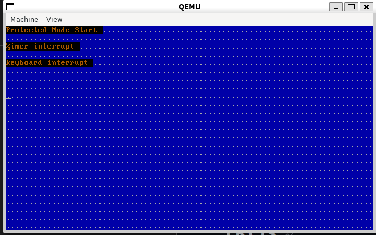

# TROS

I am creating my own operating system (TROS)

1. Make BootLoader
2. Change to protect mode
3. Make kernel
4. Compile with C

Complete a basic kprintf implementation

Takes a char* string, line, and col as arguments and iterates over the video segment and prints it out.

Current problem
1. when passing char*(str) as a string, normal output is not possible -> when passing char str[] = "foo" as an array, normal output is possible.

2. when receiving a col argument and trying to write with a certain size, the letters are broken -> Solved
In text mode video memory, each character takes up 2 bytes, one for the character itself and the other for the character's attributes (color, etc.), so you need to receive an area of col*2 for normal operation.

