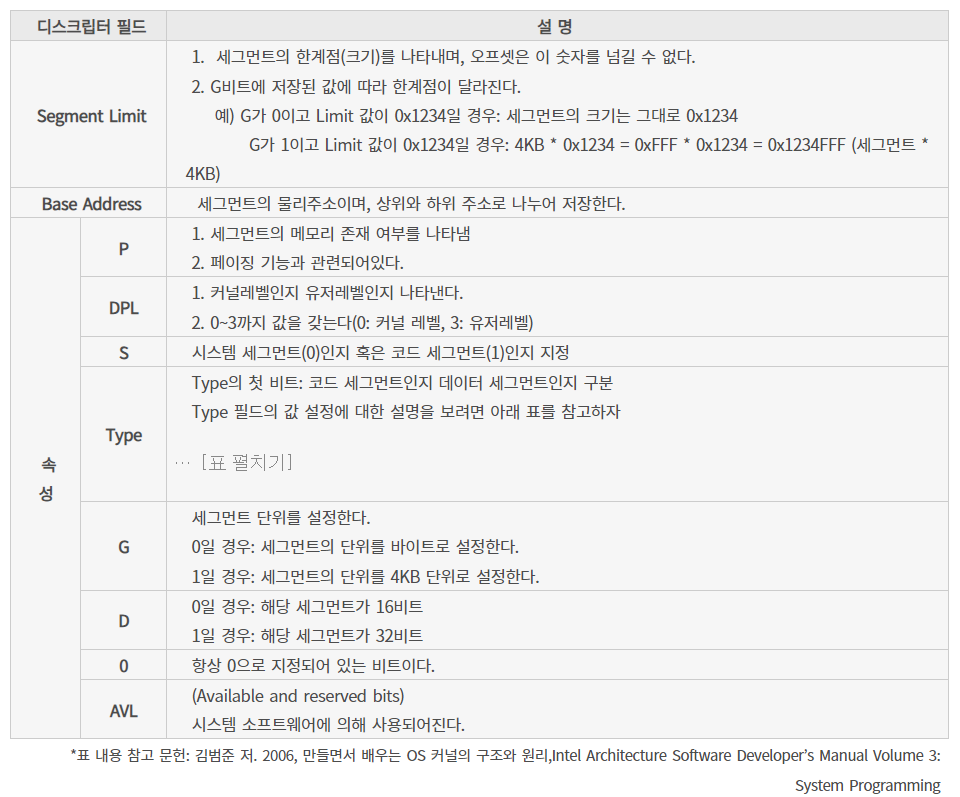

저장 장치의 첫 번째 섹터인 MBR(Master Boot Record) 부터 시작한다.
0번 섹터의 512MB 부분이다.

[org 0]                     ; 메모리의 어디에서 시작할지 지정 MBR()
[bits 16]                   ; 16비트로 동작할 것이다.
    jmp 0x07C0:start        ; 이걸 기계어로 번역하면 EA0500C007이 된다. EA는 jmp, 05는 start C007은 07C0이다. 
                            ; 리틀 엔디안을 따른다.
                            ; 따라서 start는 5바이트 0x5가 된다
                            ; 0x7C00:0x0000 = 0x7C00이다.
start:
    mov ax, cs              ; CS(segment register)의 값을 AX 레지스터로 복사한다.
                            ; CS는 현재 코드 세그먼트의 기본 주소를 가리킨다.
    
    mov ds, ax              ; AX의 값을 DS 데이터 세그먼트 레지스터로 복사한다.
                            ; DS는 일반적으로 데이터 세그먼트를 참조하는 데 사용된다.
                            ; ax로 복사하는 이유는 세그먼트 레지스터 간의 직접적인 데이터 전송은 허용하지 않기 때문이다.
                            ; 만약 ax에 값이 들어있다면
                            ; push ax 후 mv로 ax를 사용하고 pop ax로 다시 원복하면 된다.

    mov ax, 0xB800          ; AX 레지스터에 0xB800 값을 설정한다. 
                            ; 0xB800은 텍스트 모드 비디오 메모리의 시작 주소이다.
    
    mov es, ax              ; AX의 값을 ES 세그먼트 레지스터로 복사한다.
                            ; ES는 종종 목적 세그먼트로 사용되며, 여기서는 비디오 메모리를 가리키기 위해 사용된다.
    
    mov di, 0               ; DI(destination index) 레지스터를 0으로 초기화한다.
                            ; DI는 종종 문자열 연산에서 목적지 오프셋으로 사용된다.
    
    mov ax, word [msgBack]  ; msgBack에서 시작하는 메모리 위치의 word 값을 AX 레지스터로 로드한다.
                            ; 이때 word는 16 비트 데이터 크기를 의미한다.
                            ; msgBack에는 0x20과 0x17이 저장되므로 리틀 엔디안 방식이므로 0x2017이 저장된다.
    
    mov cx, 0x7EF           ; CX 레지스터에 0x7EF 값을 설정한다.
                            ; CX는 종종 반복 횟수나 문자열 연산의 길이를 저장하는 데 사용된다.

paint:
    mov word [es:di], ax       ; ES:DI가 가리키는 메모리 주소에 AX의 값을 저장한다. 
                               ; 이 경우, ES는 비디오 메모리를 가리키고, DI는 오프셋을 나타낸다.
                               ; word [es:di]는 0xB800의 비디오 메모리로부터 0의 오프셋을 의미하니 
                               ; 0x2017을 메모리 시작주소에 넣음을 의미한다.

    
    add di, 2                  ; DI 레지스터의 값을 2만큼 증가시킨다. 
                               ; 비디오 메모리에서 각 문자는 2바이트를 차지하므로 다음 위치로 이동한다.
    
    dec cx                     ; CX 레지스터의 값을 1만큼 감소시킨다.
                               ; CX가 0이되면 반복을 멈춘다.

    jnz paint                  ; CX가 0이 아니면 paint로 점프한다. 
                               ; 이 루프는 화면의 특정 영역을 AX 값으로 채우는 역할을 한다.
                               ; 즉 .을 계속 찍는 것을 의미한다.

    mov edi, 0                 ; EDI는 32비트 버전의 DI 레지스터이다. 여기서는 0으로 초기화된다.
    
    mov byte [es:edi], 'T'     ; ES:EDI가 가리키는 메모리 위치에 'T' 문자를 저장한다.
    
    inc edi                    ; EDI 레지스터 값을 1만큼 증가시킨다. 다음 바이트 위치로 이동한다.
    mov byte [es:edi], 'A'     
    inc edi
    mov byte [es:edi], 0x16    ; 0x16은 0x10(첫 바이트 : 배경색, 두 번째 바이트 : 글자색을 넣어준다.)
    inc edi
    mov byte [es:edi], 'E'
    inc edi
    mov byte [es:edi], 0x27
    inc edi
    mov byte [es:edi], 'R'
    inc edi
    mov byte [es:edi], 0x30
    inc edi
    mov byte [es:edi], 'A'
    inc edi
    mov byte [es:edi], 0x41
    inc edi
    mov byte [es:edi], 'N'
    inc edi
    mov byte [es:edi], 0x52
    inc edi
    mov byte [es:edi], 'G'

    jmp $                       ; 이후 jmp를 반복하는데 현재 메모리 주소로 계속 이동함을 의미한다.
                                ; 이는 작업이 끝냈으므로 CPU가 다른 작업을 하지 않도록 잡아두는 코드이다.
                                ; 하지만 이렇게되면 CPU가 다른 작업을 못하니 실제 실행되ㄴ지 못하낟.

msgBack db ' ', 0x17    ; 데이터 섹션에 변수를 선언하는 것. mgsBack 라벨을 통해 메모리 주소를 참조 가능 db는 define byte의 약자
                        ; 첫 번째 바이트는 공백 문자를 나타내며 ASCII에서 0x20을 의미 두 번째는 0x17는 속성을 의미 색상 속성 0x17임
                        ; 따라서 메모리에서 두 바이트의 연속적인 영역을 참조 처음 값이 0x20, 두 번째가 0x17

times 510-($-$$) db 0   ; $는 현재 메모리 주소
                        ; $$는 섹션의 시작 주소
                        ; ($-$$)는 현재 섹션에서 지금 까지의 바이트 수 즉 얼마나 썼는지
                        ; 512바이트(부트 섹션의 크기) 에서 현재까지의 바이트 수를 뺸 값
                        ; 즉 나머지를 전부 0으로 채운다는 것을 의미한다.

dw 0xAA55               ; dw는 'define word'의 약자로, 2바이트 값을 정의한다.
                        ; 0xAA55는 부트 섹터의 마지막에 전통적으로 위치하는 마법의 값(magic number)이다. 
                        ; BIOS는 이 값을 찾아서 해당 섹터가 부트 섹터인지 아닌지를 판단한다. 
                        ; 이 값이 있으면 BIOS는 해당 섹터를 실행 가능한 코드로 간주하고 실행을 시작한다.

### 세그먼트:오프셋
레지스터의 종류에는 범용 레지스터, 세그먼트 레지스터, 컨트롤 레지스터 등 다양한 역할을 담당하고 있는 레지스터들이 있다.
세그먼트 레지스터는 8086 CPU를 개발하는 과정에서 1Mb로 지정했기 때문에 address bus와 호환성 문제가 발생했다.
따라서 16비트 레지스터 2개를 이용하여 20비트의 address bus 메모리에 접근하는 방식을 채택했다.
이를 위해 segment:offset 주소체계가 사용되었다.
20비트 어드레스 버스의 물리 주소 범위는
0x00000 ~ 0xfffff로 이를 그대로 사용하면 세그먼트 레지스터들의 물리주소 영역이 중복된다. 이를 구분하기 위해 위의 주소 체계를 사용하며
세그먼트(<<4) + 오프셋 + 0x10이 된다.
즉 세그먼트가 0x0200이고 오프셋이 0x0134일 경우
0x0200(<<4)+0x0134 -> 0x2000+0x0134 *0x10 = 0x02134
가 된다.
0x0200:0x0134 = (물리주소)0x02134
1048576 = 2*20 = 0x100000

16비트 부트로더의 경우 세그먼트:오프셋 구조로
물리 주소 = (0xFFFF << 4) + 0xFFFF
          = 0xFFFF0 + 0xFFFF
          = 0x10FFEF
만큼 사용할 수 있다. 이때 0x100000이 1MB인데 이론적으로 1MB보다 약간 큰 값을 사용할 수 있지만 하드웨어적 제한으로 1MB로 제한한다.

또한 해당 세그먼트 내에서는 어떠한 메모리 주소로도 이동이 가능하기 때문에 이에 따라 민감한 데이터를 건드리게 될 수도 있다.
이를 방지하고 더 넓은 범위(high memory) 영역을 사용하기 위해 보호 모드(32bit)를 사용한다.

이를 위해 구현할 커널을 메모리에서 32비트 단위로 사용하겠다라는 명령인 GDT가 사용된다.

- Global Descriptor Table
세그먼트 영역에 대한 데이터를 일정한 디스크립터 형식으로 기술하고 이를 테이블에 모아두는 것
8바이트를 사용하며 16비트의 Segment Limit + 16비트의 Base Address + 8비트의 Base Address + 4비트 Type + 1 S + 2 DPL + 1 P
+ 4 Segment Limit + 1 AVL + 1 + 1 D + 1 G + 1 Base Address를 따른다. 
+ 

gdt : NULL 세그먼트 디스크립터를 정의해준다. 처음은 NULL을 정으해야한다. 모든 비트가 0이다.
    dw 0
    dw 0
    db 0
    db 0
    db 0
    db 0

SysCodeSelector equ 0x08 ; 코드 세그먼트
    dw 0xFFFF               ; 세그먼트 리미트 0~15비트
    dw 0x0000               ; 베이스 어드레스 하위 0~15비트
    db 0x01                 ; 베이스 어드레스 상위 16~23비트
    db 0x9A                 ; 속성비트(1001 1010) -> P, DPL, S, Type 메모리가 존재하며 커널레벨이고 코드 세그먼트이며 Read이다.
    db 0xCF                 ; 속성 비트(1100 1111) -> G, D, 예약, AVL, 세그먼트 리미트 16~19비트 -> 4KB단위, 32비트, 0, 
    db 0x00                 ; 베이스 어드레스 상위 24~31비트

SysCodeSelector는 코드 세그먼트를 위한 디스크립터입니다. 여기서 equ 0x08은 이 디스크립터의 오프셋이 GDT에서 8바이트라는 것을 의미한다.
dw 0xFFFF와 dw 0x0000은 세그먼트의 길이와 시작 주소를 나타낸다.
db 0x01은 세그먼트의 시작 주소의 상위 바이트를 나타낸다.
db 0x9A는 디스크립터의 타입과 권한을 설정한다. 9A는 실행 가능한 코드 세그먼트를 나타내며, 읽기 전용이다.
db 0xCF와 db 0x00은 세그먼트의 기타 속성을 설정한다.

SysDataSelector equ 0x10 -> gdt에서 오프셋이 16바이트라는 뜻
    dw 0x0000
    dw 0x0000
    db 0x01
    db 0x92
    db 0xCF
    db 0x00
VideoSelector equ 0x18 -> gdt에서 오프셋이 24바이트라는 뜻
    dw 0xFFFF
    dw 0x8000
    db 0x0B
    db 0x92
    db 0xCF
    db 0x00
이렇게 GDT 설정이 완료된다. 이를 사용하곘다고 시스템에 알려주면 되는데 이는 lgdt[gdtr]명령으로 GDTR이라는 레지스터를 통해 GDT를 LGDT에 저장해준다.

LGDT(포인터)는 메모리에서 GDT가 가지고 있는 베이스 어드레스와 세그먼트 리미트 값을 인자 값으로 전달 받고, 이를 GDTR 레지스터에 저장한다.